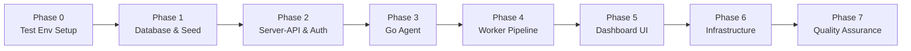
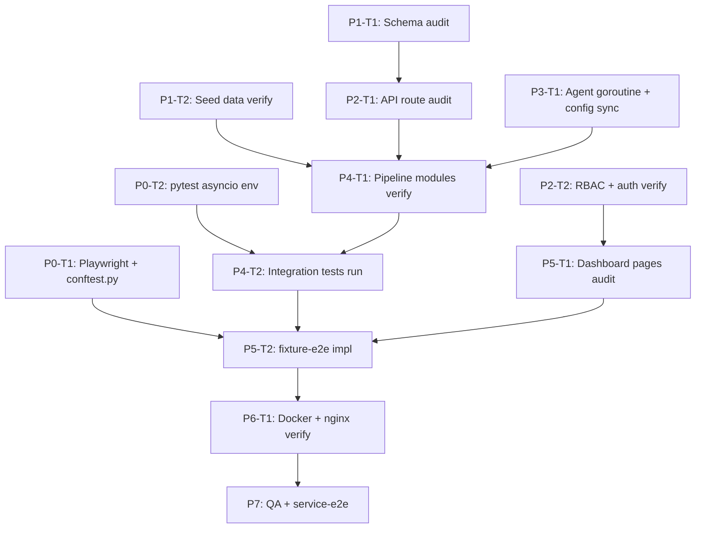

# Work Plan: SIEM Platform — Full Design Doc Compliance

Created Date: 2026-05-30
Type: feature
Estimated Duration: 8 days
Estimated Impact: 40+ files across all layers
Related Issue/PR: —
Implementation Readiness: pending

## Related Documents
- Design Doc: [docs/superpowers/specs/2026-05-21-siem-platform-design.md]

## Verification Strategy (from Design Doc)

The Design Doc defines the platform through observable behaviors at each layer boundary rather than an explicit verification strategy section. The following is derived from the spec's pipeline description and acceptance criteria:

### Correctness Proof Method
- **Correctness definition**: A log message ingested by the agent arrives at the worker via Redis Streams, is decoded into structured fields matching the decoder YAML pattern, persists as RawLog + Event rows in PostgreSQL, and — when a Sigma rule matches — generates an Alert row with correct severity, source_ip, and suppression/deduplication behavior. The dashboard reflects this data accurately within the auto-refresh interval.
- **Verification method**: Integration tests exercise the worker pipeline with mocked DB and Redis (fast, in-process). fixture-e2e tests exercise the full dashboard flow with mocked API. service-integration-e2e tests exercise the login flow against the live docker-compose stack.
- **Verification timing**: Integration tests execute at phase completion. fixture-e2e tests execute alongside the UI implementation phase. service-integration-e2e tests execute in the final QA phase only.

### Early Verification Point
- **First verification target**: Worker pipeline integration test (`test_process_message_decode_and_alert`) — proves that `process_message` correctly decodes an SSH auth log, persists RawLog + Event, and calls `create_alert` with correct arguments.
- **Success criteria**: All three integration tests in `tests/worker/test_pipeline.int.test.py` pass against the existing worker implementation without modification.
- **Failure response**: Investigate mismatches between test expectations and actual `consumer.py` / `alert_manager.py` signatures before proceeding to any new implementation.

## Quality Assurance Mechanisms (from Design Doc)

| Mechanism | Enforces | Config Location | Covered Files |
|-----------|----------|-----------------|---------------|
| TypeScript compiler (`tsc -b`) | Type correctness in dashboard | `dashboard/tsconfig.app.json` | `dashboard/src/**/*.tsx`, `dashboard/src/**/*.ts` |
| Vite build (`npm run build`) | Bundle compiles without errors | `dashboard/vite.config.ts` | `dashboard/src/**` |
| pytest (asyncio) | Worker pipeline unit + integration test coverage | `worker/pytest.ini` or `pyproject.toml` | `worker/worker/**/*.py` |
| Playwright (Python) | fixture-e2e and service-e2e browser test correctness | `tests/` | `tests/dashboard/`, `tests/test_siem_platform.service.e2e.test.py` |
| structlog JSON output | Sensitive data not leaked in logs | `worker/worker/main.py`, `worker/worker/*.py` | `worker/worker/**/*.py`, `server-api/app/**/*.py` |
| Docker HEALTHCHECK | All services pass startup healthcheck | `docker-compose.yml` | `server-api/`, `worker/` |

## Design-to-Plan Traceability

| Design Doc | DD Section | DD Item | Category | Covered By Task(s) | Gap Status | Notes |
|---|---|---|---|---|---|---|
| docs/superpowers/specs/2026-05-21-siem-platform-design.md | §2 Database Schema | `roles`, `permissions`, `role_permissions`, `users` tables | impl-target | Phase 1 Task 1 | covered | `db/init.sql` already has these; verify completeness |
| docs/superpowers/specs/2026-05-21-siem-platform-design.md | §2 Database Schema | `agents`, `agent_log_sources` tables | impl-target | Phase 1 Task 1 | covered | Exists in `db/init.sql` |
| docs/superpowers/specs/2026-05-21-siem-platform-design.md | §2 Database Schema | `raw_logs`, `events` tables (JSONB decoded_fields, partition note) | impl-target | Phase 1 Task 1 | covered | Exists; daily partition is a note, not a requirement in MVP |
| docs/superpowers/specs/2026-05-21-siem-platform-design.md | §2 Database Schema | `rules`, `decoders`, `alerts`, `alert_notes` tables | impl-target | Phase 1 Task 1 | covered | Exists in `db/init.sql` |
| docs/superpowers/specs/2026-05-21-siem-platform-design.md | §2 Database Schema | `audit_logs`, `webhook_configs`, `webhook_deliveries` tables | impl-target | Phase 1 Task 1 | covered | Exists in `db/init.sql` |
| docs/superpowers/specs/2026-05-21-siem-platform-design.md | §3 API Endpoints | Auth: login, refresh, me | impl-target | Phase 2 Task 1 | covered | `server-api/app/api/routes/auth.py` exists |
| docs/superpowers/specs/2026-05-21-siem-platform-design.md | §3 API Endpoints | Users CRUD | impl-target | Phase 2 Task 1 | covered | `server-api/app/api/routes/users.py` exists |
| docs/superpowers/specs/2026-05-21-siem-platform-design.md | §3 API Endpoints | Agents CRUD + log-sources sub-resource | impl-target | Phase 2 Task 1 | covered | `server-api/app/api/routes/agents.py` exists |
| docs/superpowers/specs/2026-05-21-siem-platform-design.md | §3 API Endpoints | Logs and Events GET | impl-target | Phase 2 Task 1 | covered | `server-api/app/api/routes/logs.py`, `events.py` exist |
| docs/superpowers/specs/2026-05-21-siem-platform-design.md | §3 API Endpoints | Alerts GET + PUT + notes POST | impl-target | Phase 2 Task 1 | covered | `server-api/app/api/routes/alerts.py` exists |
| docs/superpowers/specs/2026-05-21-siem-platform-design.md | §3 API Endpoints | Rules CRUD + test endpoint | impl-target | Phase 2 Task 1 | covered | `server-api/app/api/routes/rules.py` exists |
| docs/superpowers/specs/2026-05-21-siem-platform-design.md | §3 API Endpoints | Decoders CRUD + test endpoint | impl-target | Phase 2 Task 1 | covered | `server-api/app/api/routes/decoders.py` exists |
| docs/superpowers/specs/2026-05-21-siem-platform-design.md | §3 API Endpoints | Webhooks CRUD | impl-target | Phase 2 Task 1 | covered | `server-api/app/api/routes/webhooks.py` exists |
| docs/superpowers/specs/2026-05-21-siem-platform-design.md | §3 API Endpoints | Ingest: `POST /api/ingest/log`, `POST /api/ingest/heartbeat` | impl-target | Phase 2 Task 1 | covered | `server-api/app/api/routes/ingest.py` exists |
| docs/superpowers/specs/2026-05-21-siem-platform-design.md | §3 API Endpoints | `GET /health`, `GET /metrics` | impl-target | Phase 2 Task 1 | covered | `server-api/app/api/routes/system.py` exists |
| docs/superpowers/specs/2026-05-21-siem-platform-design.md | §4 Auth & RBAC | JWT flow: access_token 15min + refresh_token httpOnly cookie 7d | impl-target | Phase 2 Task 2 | covered | `server-api/app/core/security.py` exists |
| docs/superpowers/specs/2026-05-21-siem-platform-design.md | §4 Auth & RBAC | Agent enrollment flow with AGENT_ENROLLMENT_TOKEN | impl-target | Phase 2 Task 2 | covered | `server-api/app/api/routes/ingest.py` handles enrollment |
| docs/superpowers/specs/2026-05-21-siem-platform-design.md | §4 Auth & RBAC | Heartbeat + config sync: config_hash comparison, hot-reload | impl-target | Phase 3 Task 1 (agent) | covered | Agent heartbeat loop in `agent/internal/heartbeat/` |
| docs/superpowers/specs/2026-05-21-siem-platform-design.md | §4 Auth & RBAC | RBAC permission matrix (4 roles, 11 permissions) | impl-target | Phase 2 Task 2 | covered | `server-api/app/core/deps.py` + seed in `main.py` |
| docs/superpowers/specs/2026-05-21-siem-platform-design.md | §4 Auth & RBAC | Group isolation via `get_scoped_group()` FastAPI dependency | impl-target | Phase 2 Task 2 | covered | `server-api/app/core/deps.py` |
| docs/superpowers/specs/2026-05-21-siem-platform-design.md | §4 Auth & RBAC | Audit logging as background task (non-blocking) | impl-target | Phase 2 Task 2 | covered | `server-api/app/services/audit.py` exists |
| docs/superpowers/specs/2026-05-21-siem-platform-design.md | §5 Worker Pipeline | Startup sequence: DB/Redis connect, load decoders/rules, seed YAML | impl-target | Phase 4 Task 1 | covered | `worker/worker/main.py` + `seeder.py` exist |
| docs/superpowers/specs/2026-05-21-siem-platform-design.md | §5 Worker Pipeline | Per-message pipeline: XREADGROUP → decode → save → sigma → alert | impl-target | Phase 4 Task 1 | covered | `worker/worker/consumer.py` exists |
| docs/superpowers/specs/2026-05-21-siem-platform-design.md | §5 Worker Pipeline | Decoder Engine: regex, named groups, priority ordering, log_type match | impl-target | Phase 4 Task 1 | covered | `worker/worker/decoder_engine.py` exists |
| docs/superpowers/specs/2026-05-21-siem-platform-design.md | §5 Worker Pipeline | Sigma Engine: all 6 condition types, threshold/suppression | impl-target | Phase 4 Task 1 | covered | `worker/worker/sigma_engine.py` exists |
| docs/superpowers/specs/2026-05-21-siem-platform-design.md | §5 Worker Pipeline | Alert Manager: create alert, webhook delivery queuing | impl-target | Phase 4 Task 1 | covered | `worker/worker/alert_manager.py` exists |
| docs/superpowers/specs/2026-05-21-siem-platform-design.md | §5 Worker Pipeline | Alert deduplication: 30-min window bump `duplicate_count` | impl-target | Phase 4 Task 2 | covered | `alert_manager.py` has dedup logic; test in int-test skeleton |
| docs/superpowers/specs/2026-05-21-siem-platform-design.md | §5 Worker Pipeline | Alert suppression: `AlertSuppression` record blocks creation | impl-target | Phase 4 Task 2 | covered | `alert_manager.py` + `_is_suppressed`; test in int-test skeleton |
| docs/superpowers/specs/2026-05-21-siem-platform-design.md | §5 Worker Pipeline | Webhook retry: every 30s, attempts² × 30s backoff, max 5 | impl-target | Phase 4 Task 1 | covered | `worker/worker/webhook_sender.py` exists |
| docs/superpowers/specs/2026-05-21-siem-platform-design.md | §5 Worker Pipeline | Background reload loop every 60s | impl-target | Phase 4 Task 1 | covered | `consumer.py::reload_loop` exists |
| docs/superpowers/specs/2026-05-21-siem-platform-design.md | §5 Worker Pipeline | DLQ retry loop (failed stream → re-inject) | impl-target | Phase 4 Task 1 | covered | `consumer.py::dlq_retry_loop` exists |
| docs/superpowers/specs/2026-05-21-siem-platform-design.md | §6 Go Agent | Package structure: config, tailer, client, heartbeat, buffer, enrollment | impl-target | Phase 3 Task 1 | covered | `agent/internal/` directories exist |
| docs/superpowers/specs/2026-05-21-siem-platform-design.md | §6 Go Agent | Goroutine model: enrollment → heartbeat → tailer manager → sender → fsnotify | impl-target | Phase 3 Task 1 | covered | `agent/cmd/agent/main.go` exists |
| docs/superpowers/specs/2026-05-21-siem-platform-design.md | §6 Go Agent | Ring buffer 10k entries, exponential backoff, drop oldest + counter | impl-target | Phase 3 Task 1 | covered | `agent/internal/buffer/` exists |
| docs/superpowers/specs/2026-05-21-siem-platform-design.md | §6 Go Agent | Log payload JSON schema | contract-change | Phase 3 Task 1 | covered | Payload defined in agent client; ingest endpoint validates |
| docs/superpowers/specs/2026-05-21-siem-platform-design.md | §7 Dashboard | Tech stack: React 18, Vite, TS, TailwindCSS, shadcn/ui, Zustand, TanStack Query, axios, CodeMirror | prerequisite | Phase 5 Task 1 | covered | `dashboard/package.json` confirms all deps present |
| docs/superpowers/specs/2026-05-21-siem-platform-design.md | §7 Dashboard | 11 pages with correct routes and min-role guards | impl-target | Phase 5 Task 1 | covered | All pages exist in `dashboard/src/pages/` |
| docs/superpowers/specs/2026-05-21-siem-platform-design.md | §7 Dashboard | Tables: sort, search, date-range filter, pagination 25/50/100 | impl-target | Phase 5 Task 1 | covered | `DataTable.tsx` component exists |
| docs/superpowers/specs/2026-05-21-siem-platform-design.md | §7 Dashboard | Severity and status badges | impl-target | Phase 5 Task 1 | covered | `SeverityBadge.tsx`, `StatusBadge.tsx` exist |
| docs/superpowers/specs/2026-05-21-siem-platform-design.md | §7 Dashboard | Alert detail modal: fields + notes thread + status/assignee | impl-target | Phase 5 Task 2 | covered | `AlertDetailModal.tsx` exists; fixture-e2e tests validate |
| docs/superpowers/specs/2026-05-21-siem-platform-design.md | §7 Dashboard | YAML editor modal: CodeMirror + validate button | impl-target | Phase 5 Task 1 | covered | `YamlEditor.tsx` exists |
| docs/superpowers/specs/2026-05-21-siem-platform-design.md | §7 Dashboard | Sidebar: menu items not rendered (not just hidden) for unauthorized roles | impl-target | Phase 5 Task 2 | covered | `Sidebar.tsx` exists; fixture-e2e login test verifies role-based rendering |
| docs/superpowers/specs/2026-05-21-siem-platform-design.md | §7 Dashboard | Toast notifications on all mutations | impl-target | Phase 5 Task 1 | covered | `@radix-ui/react-toast` in deps |
| docs/superpowers/specs/2026-05-21-siem-platform-design.md | §7 Dashboard | Dark mode default with toggle | impl-target | Phase 5 Task 1 | covered | Specified as `dark` class on `<html>` |
| docs/superpowers/specs/2026-05-21-siem-platform-design.md | §7 Dashboard | Auto-refresh intervals per page | impl-target | Phase 5 Task 1 | covered | TanStack Query `refetchInterval` |
| docs/superpowers/specs/2026-05-21-siem-platform-design.md | §8 Docker & Nginx | Three compose files (base, dev, prod) with healthchecks | impl-target | Phase 6 Task 1 | covered | All three compose files exist |
| docs/superpowers/specs/2026-05-21-siem-platform-design.md | §8 Docker & Nginx | Nginx: `/api/*` proxy + static SPA + gzip + security headers | impl-target | Phase 6 Task 1 | covered | `nginx/nginx.conf` exists |
| docs/superpowers/specs/2026-05-21-siem-platform-design.md | §8 Docker & Nginx | Observability: all 9 Prometheus metrics from worker | impl-target | Phase 4 Task 3 | covered | Prometheus counters/gauges defined in `consumer.py` + `main.py` |
| docs/superpowers/specs/2026-05-21-siem-platform-design.md | §8 Docker & Nginx | `GET /health` response schema for server-api and worker | verification | Phase 6 Task 1 | covered | `system.py` + worker `HealthHandler` |
| docs/superpowers/specs/2026-05-21-siem-platform-design.md | §8 Docker & Nginx | Structured JSON logging: slog (Go), structlog (Python) | impl-target | Phase 3 Task 1, Phase 4 Task 1 | covered | Both already configured |
| docs/superpowers/specs/2026-05-21-siem-platform-design.md | §9 Seed Data | Default admin user (superadmin) | prerequisite | Phase 1 Task 2 | covered | `db/init.sql` seeds admin user |
| docs/superpowers/specs/2026-05-21-siem-platform-design.md | §9 Seed Data | 4 sample decoders from YAML files | impl-target | Phase 4 Task 1 | covered | `decoders/` directory + `seeder.py` |
| docs/superpowers/specs/2026-05-21-siem-platform-design.md | §9 Seed Data | 7 sample rules from YAML files | impl-target | Phase 4 Task 1 | covered | `rules/` directory + `seeder.py` |
| docs/superpowers/specs/2026-05-21-siem-platform-design.md | §11 Key Decisions | Redis Streams as message queue + suppression cache | connection-switching | Phase 4 Task 1 | covered | `siem:logs` stream + Redis ZSET in sigma_engine |
| docs/superpowers/specs/2026-05-21-siem-platform-design.md | §11 Key Decisions | Rules/decoders stored as YAML text in DB | impl-target | Phase 4 Task 1 | covered | `content` TEXT column in `rules` + `decoders` tables |
| docs/superpowers/specs/2026-05-21-siem-platform-design.md | §11 Key Decisions | Webhook delivery with retry + backoff | impl-target | Phase 4 Task 1 | covered | `webhook_sender.py` |
| docs/superpowers/specs/2026-05-21-siem-platform-design.md | §5 Worker Pipeline | Worker integration test: process_message → decode → alert | verification | Phase 4 Task 2 | covered | `tests/worker/test_pipeline.int.test.py::test_process_message_decode_and_alert` |
| docs/superpowers/specs/2026-05-21-siem-platform-design.md | §5 Worker Pipeline | Worker integration test: alert deduplication | verification | Phase 4 Task 2 | covered | `tests/worker/test_pipeline.int.test.py::test_create_alert_deduplication_increments_count` |
| docs/superpowers/specs/2026-05-21-siem-platform-design.md | §5 Worker Pipeline | Worker integration test: alert suppression | verification | Phase 4 Task 2 | covered | `tests/worker/test_pipeline.int.test.py::test_create_alert_blocked_by_suppression` |
| docs/superpowers/specs/2026-05-21-siem-platform-design.md | §7 Dashboard | fixture-e2e: login → dashboard journey (2-step, state carries) | verification | Phase 5 Task 2 | covered | `tests/dashboard/test_siem_platform.fixture.e2e.test.py::TestLoginToDashboardJourney` |
| docs/superpowers/specs/2026-05-21-siem-platform-design.md | §7 Dashboard | fixture-e2e: alert list → modal → status update | verification | Phase 5 Task 2 | covered | `tests/dashboard/test_siem_platform.fixture.e2e.test.py::TestAlertDetailModalWorkflow` |
| docs/superpowers/specs/2026-05-21-siem-platform-design.md | §7 Dashboard | fixture-e2e: login error display | verification | Phase 5 Task 2 | covered | `tests/dashboard/test_siem_platform.fixture.e2e.test.py::TestLoginErrorDisplay` |
| docs/superpowers/specs/2026-05-21-siem-platform-design.md | §4 Auth & RBAC | service-e2e: login with real JWT + PostgreSQL + argon2 | verification | Phase 7 (QA) | covered | `tests/test_siem_platform.service.e2e.test.py::TestLoginDashboardRealStack` |

## Connection Map

| Boundary | Owner (left side) | Owner (right side) | Expected Signal | Covered By Task(s) |
|---|---|---|---|---|
| Agent → server-api ingest | `agent/internal/client/` (Go HTTP client) | `server-api/app/api/routes/ingest.py` | HTTP 200 from `POST /api/ingest/log`; message visible in `siem:logs` Redis stream | Phase 3 Task 1 (agent), Phase 2 Task 1 (server-api) |
| server-api → Redis Streams | `server-api/app/services/ingest.py` | Redis `siem:logs` stream | `XADD` returns a stream entry ID; worker `XREADGROUP` receives the message | Phase 2 Task 1, Phase 4 Task 1 |
| Redis Streams → Worker | `worker/worker/consumer.py` (XREADGROUP) | `worker/worker/decoder_engine.py`, `sigma_engine.py` | Worker processes message, RawLog + Event rows inserted in PostgreSQL, alert generated on rule match | Phase 4 Task 1, Phase 4 Task 2 |
| Dashboard → server-api | `dashboard/src/api/client.ts` (axios) | `server-api/app/main.py` (FastAPI, via nginx) | HTTP 200 with JSON payloads matching schema; 401 triggers token refresh interceptor | Phase 5 Task 1, Phase 2 Task 1 |
| nginx → dashboard / server-api | nginx reverse proxy | `dashboard` static files + `server-api:8000` | `/api/*` requests route to server-api; `/*` serves SPA; gzip and security headers present | Phase 6 Task 1 |

## Objective

Verify and complete the SIEM platform implementation to fully satisfy the Design Doc specification. The platform spans a Go agent, Python FastAPI server, Python asyncio worker, React dashboard, and Docker infrastructure. Substantial implementation already exists. This plan ensures all Design Doc items are covered, test skeletons pass, and the full stack operates end-to-end.

## Background

The SIEM platform was initially built across several focused plans (foundation-api, worker, agent, dashboard, infrastructure, missing-features, UEBA, SOAR). This plan provides a unified compliance and verification pass against the root Design Doc, executes the integration and E2E test skeletons, and fills any remaining gaps.

## Risks and Countermeasures

### Technical Risks
- **Risk**: Worker integration tests depend on `worker.consumer.ueba_score_event` and `worker.alert_manager` module-level patches matching exact import paths.
  - **Impact**: Tests fail with `ModuleNotFoundError` or patching miss if paths differ.
  - **Countermeasure**: Run integration tests immediately in Phase 0 to detect mismatches. Fix import paths before any new work.
- **Risk**: Playwright fixture-e2e tests require a running Vite dev server or nginx-served build. No test framework is pre-configured in `package.json`.
  - **Impact**: fixture-e2e tests cannot run without Playwright installed and dev server up.
  - **Countermeasure**: Phase 0 installs Playwright and configures `conftest.py` with `page` and `mock_api` fixtures. Tests are created and run alongside Phase 5.
- **Risk**: service-e2e test requires full docker-compose.dev.yml stack. Seed user and DB state must be correct.
  - **Impact**: Test fails if DB not seeded or stack not running.
  - **Countermeasure**: Documented as pre-condition in Phase 7. Not run in CI without local stack.
- **Risk**: Alert `duplicate_count` column may not exist in older DB migrations.
  - **Impact**: `test_create_alert_deduplication_increments_count` fails at model level.
  - **Countermeasure**: Verify `Alert.duplicate_count` column exists in `db/init.sql` and worker models before Phase 4.

### Schedule Risks
- **Risk**: The existing implementation may have drifted from the Design Doc (e.g., additional endpoints or models added beyond spec scope).
  - **Impact**: Extra items not in DD do not block plan completion.
  - **Countermeasure**: Traceability table only covers DD-specified items. Extra features are out of scope for this plan.

---

## Phase Structure Diagram

## Task Dependency Diagram

---

## Implementation Phases

### Phase 0: Test Environment Setup (Estimated commits: 1)

**Purpose**: Establish the test harnesses required by the three skeleton test files before any implementation work begins.

**E2E Prerequisites detected from skeleton files:**

From `tests/dashboard/test_siem_platform.fixture.e2e.test.py` (`@lane: fixture-e2e`):
- `@dependency: full-ui (mocked backend)` — requires Playwright Python bindings and a `mock_api` fixture implementing route interception
- `@dependency: full-ui (mocked backend)` — fixture data files (`FIXTURE_ALERTS`, `FIXTURE_USER_ADMIN`) are inline; no external fixture data files needed
- Browser harness: Playwright (Python `playwright.sync_api`); no live backend required

From `tests/test_siem_platform.service.e2e.test.py` (`@lane: service-integration-e2e`):
- `@dependency: full-system` — live docker-compose.dev.yml stack; seed user `admin/admin123` must exist
- Environment: `BASE_URL = "http://localhost"` — nginx on port 80 must be accessible

#### Tasks

- [ ] **Task 1: Install Playwright Python bindings and configure fixture-e2e conftest**
  - `pip install playwright && playwright install chromium` in the test environment
  - Create `tests/dashboard/conftest.py` with `page` fixture (Playwright `sync_playwright`) and `mock_api` fixture using `page.route()` to intercept API calls
  - Verify Playwright launches headless Chromium successfully
  - Completion: `playwright install` exits 0; `conftest.py` fixture file present; a trivial `page.goto("about:blank")` passes
  - `@category: e2e-setup` `@lane: fixture-e2e`

- [ ] **Task 2: Configure pytest + pytest-asyncio for worker integration tests**
  - Ensure `pytest-asyncio` is installed in the worker Python environment
  - Create or verify `tests/worker/conftest.py` with `asyncio_mode = "auto"` or equivalent
  - Run `pytest tests/worker/test_pipeline.int.test.py --collect-only` to confirm collection succeeds (3 tests discovered)
  - Completion: pytest collection exits 0; 3 test names appear in output (no import errors)
  - `@category: e2e-setup` `@lane: integration`

- [ ] **Task 3: Document service-e2e pre-conditions in tests/conftest.py**
  - Add a top-level `tests/conftest.py` that skips `@pytest.mark.service_e2e` tests automatically when `docker-compose` stack is not detected (e.g., `GET http://localhost/health` fails)
  - Mark `TestLoginDashboardRealStack` with `@pytest.mark.service_e2e`
  - Completion: `pytest tests/test_siem_platform.service.e2e.test.py -m "not service_e2e"` collects 0 tests (auto-skipped); running with `-m service_e2e` without stack outputs a clear skip message
  - `@category: e2e-setup` `@lane: service-integration-e2e`

#### Phase Completion Criteria
- [ ] Playwright installs successfully and chromium is available
- [ ] Worker integration test collection: 3 tests discovered, no ImportError
- [ ] service-e2e conftest auto-skip mechanism in place

---

### Phase 1: Database Schema and Seed Data (Estimated commits: 1)

**Purpose**: Verify `db/init.sql` fully matches the Design Doc §2 schema and that the seed data in §9 is present. Fix any gaps.

#### Tasks

- [ ] **Task 1: Audit db/init.sql against Design Doc §2 schema**
  - Verify all tables from §2 exist: `roles`, `permissions`, `role_permissions`, `users`, `agents`, `agent_log_sources`, `raw_logs`, `events`, `rules`, `decoders`, `alerts`, `alert_notes`, `audit_logs`, `webhook_configs`, `webhook_deliveries`
  - Verify `raw_logs` has no `updated_at` (append-only per DD design note)
  - Verify `events.decoded_fields` is `JSONB`
  - Verify `group_id` columns exist on `agents`, `events`, `alerts`, `rules`, `webhook_configs`
  - Verify `alerts.duplicate_count` column exists (required by deduplication integration test)
  - Fix any missing columns or constraints found
  - Completion: `db/init.sql` creates all tables listed in §2; `duplicate_count` column present on `alerts`

- [ ] **Task 2: Verify seed data (default admin + decoders + rules)**
  - Confirm `db/init.sql` inserts default superadmin user `admin/admin123`
  - Confirm all 4 decoder YAML files exist in `decoders/` with correct names from §9
  - Confirm all 7 rule YAML files exist in `rules/` with correct names from §9
  - Confirm `worker/worker/seeder.py` reads from `DECODERS_DIR` and `RULES_DIR` env vars
  - Completion: all 11 YAML files present; seeder upserts them without error on a clean DB

#### Phase Completion Criteria
- [ ] `db/init.sql` audited against §2 — all tables and columns present
- [ ] `alerts.duplicate_count` column exists
- [ ] 4 decoder YAMLs + 7 rule YAMLs confirmed present

---

### Phase 2: Server-API Routes and Auth (Estimated commits: 1)

**Purpose**: Verify all Design Doc §3 API endpoints are registered and §4 auth/RBAC is fully implemented.

#### Tasks

- [ ] **Task 1: Audit API route coverage against Design Doc §3**
  - Check `server-api/app/main.py` router registrations for all groups in §3: auth, users, agents, logs, events, alerts, rules, decoders, webhooks, ingest, system
  - Verify `POST /api/rules/test` and `POST /api/decoders/test` endpoints exist (test endpoints)
  - Verify `GET /api/agents/{id}/log-sources`, `POST`, `PUT`, `DELETE` sub-resource routes exist
  - Fix any missing route registrations
  - Completion: `GET /openapi.json` or route inspection lists all §3 endpoints; no 404s on documented routes

- [ ] **Task 2: Verify auth + RBAC implementation against Design Doc §4**
  - Confirm JWT flow: access_token 15min, refresh_token 7 days httpOnly cookie
  - Confirm `X-Agent-Token` header validation in ingest routes
  - Confirm RBAC permission matrix seeds correct roles/permissions on startup
  - Confirm `get_scoped_group()` dependency applied to all data queries (group_id filter)
  - Confirm audit logging fires as background task for all 12 event types listed in §4
  - Completion: JWT and RBAC logic matches §4 spec; audit_log service fires non-blocking

#### Phase Completion Criteria
- [ ] All §3 endpoints verified registered and returning correct HTTP status codes
- [ ] JWT flow, RBAC matrix, group isolation, and audit logging confirmed correct

---

### Phase 3: Go Agent (Estimated commits: 1)

**Purpose**: Verify the Go agent implementation matches Design Doc §6: goroutine model, buffer behavior, enrollment, heartbeat, and config sync.

#### Tasks

- [ ] **Task 1: Audit Go agent implementation against Design Doc §6**
  - Verify package structure: `config/`, `tailer/`, `client/`, `heartbeat/`, `buffer/`, `enrollment/` all exist under `agent/internal/`
  - Verify goroutine model: main → enrollment (blocking) → heartbeat loop → tailer manager → sender loop → fsnotify → signal handler
  - Verify buffer: 10k default capacity, exponential backoff 1s→2s→4s→max 60s, drop oldest + `buffer_dropped` counter, FIFO drain on reconnect
  - Verify enrollment: sends `enrollment_token`, `hostname`, `version`, `group`, `log_sources`; receives and stores agent token
  - Verify heartbeat: sends `agent_id`, `status`, `version`, `buffer_dropped`; reads `config_hash` + `log_sources` from response; triggers hot-reload on hash change
  - Verify log payload schema matches §6: `agent_id`, `agent_token`, `log_type`, `raw_message`, `received_at`, `hostname`
  - Verify `config.yaml` hot-reload scope: only `agent.name`, `agent.group`, `server.url` via fsnotify (not log sources — those come from heartbeat)
  - Fix any deviations found
  - Completion: Agent goroutine model and all behavioral specs from §6 verified; Go build succeeds: `CGO_ENABLED=0 GOOS=linux GOARCH=amd64 go build ./cmd/agent/`

#### Phase Completion Criteria
- [ ] All §6 agent behavioral specs verified
- [ ] `go build ./cmd/agent/` exits 0 (Linux amd64)

---

### Phase 4: Worker Pipeline (Estimated commits: 2)

**Purpose**: Verify the full worker pipeline per Design Doc §5, then run the three integration tests to confirm correctness.

**Verification**: Integration tests from `tests/worker/test_pipeline.int.test.py` execute at Task 2 completion.

#### Tasks

- [ ] **Task 1: Audit worker pipeline modules against Design Doc §5**
  - Verify startup sequence in `worker/worker/main.py`: all 9 steps from §5 present (DB/Redis connect, load decoders/rules, seed YAML, create stream+group, reload loop, webhook retry loop, health/metrics server, main consume loop)
  - Verify per-message pipeline in `consumer.py`: all pipeline stages present with XACK on success and DLQ write on exception
  - Verify DecoderEngine handles all fields-map/static-fields logic per §5 decoder YAML format
  - Verify SigmaEngine supports all 6 condition types from §5: exact match, contains, startswith, endswith, list match, condition expressions (selection, not, and, or)
  - Verify threshold logic uses Redis ZSET sliding window with `group_by` support
  - Verify suppression uses `siem:suppress:{rule_id}:{src_ip}` Redis key with TTL per §5
  - Verify webhook retry: every 30s, `attempts² × 30s` backoff, max 5 attempts then status=failed
  - Verify all 9 Prometheus metrics defined: `siem_logs_ingested_total`, `siem_events_decoded_total`, `siem_decode_failures_total`, `siem_alerts_generated_total{severity,rule_id}`, `siem_sigma_matches_total{rule_id}`, `siem_worker_queue_lag`, `siem_webhook_deliveries_total{status}`, `siem_active_agents`
  - Fix any deviations from spec
  - Completion: All §5 pipeline stages implemented; metric names match §8 spec exactly

- [ ] **Task 2: Run worker pipeline integration tests (test_pipeline.int.test.py)**
  - Execute: `cd /home/wonka/Documents/hackathon && python -m pytest tests/worker/test_pipeline.int.test.py -v`
  - Tests to pass:
    - `test_process_message_decode_and_alert`: verifies RawLog + Event saved, `create_alert` called with `source_ip='1.2.3.4'` and `level='high'`
    - `test_create_alert_deduplication_increments_count`: verifies `duplicate_count` incremented to 3, existing ID returned, `db.add` not called
    - `test_create_alert_blocked_by_suppression`: verifies return value is `None`, `db.add` never called, `db.commit` never called
  - Fix any failures before proceeding to Phase 5
  - Test case resolution target: 3/3
  - Completion: All 3 integration tests pass; 0 failures, 0 errors

#### Phase Completion Criteria
- [ ] All §5 worker pipeline specs verified
- [ ] Integration tests: 3/3 passing
- [ ] Prometheus metrics: all 9 from §8 confirmed defined

---

### Phase 5: Dashboard UI (Estimated commits: 2)

**Purpose**: Verify all §7 dashboard pages, UI patterns, and role-based rendering; then implement and run the fixture-e2e tests.

**Verification**: fixture-e2e tests from `tests/dashboard/test_siem_platform.fixture.e2e.test.py` execute at Task 2 completion.

**Test skeleton**: `tests/dashboard/test_siem_platform.fixture.e2e.test.py`

#### Tasks

- [ ] **Task 1: Audit dashboard pages and UI patterns against Design Doc §7**
  - Verify all 11 routes exist with correct min-role guards per §7 table: Login, Dashboard, Agents, Agent Log Sources, Logs, Events, Alerts, Alert Detail, Rules, Decoders, Users, Webhooks
  - Verify auto-refresh intervals: Dashboard+Agents=30s, Logs+Events+Alerts=15s
  - Verify `DataTable` component provides column sort, text search, date-range filter, pagination with 25/50/100 options
  - Verify `SeverityBadge`: critical=red, high=orange, medium=yellow, low=blue, info=gray
  - Verify `StatusBadge`: new=blue, in_progress=yellow, resolved=green, false_positive=gray
  - Verify `Sidebar` menu items are not rendered (not just `display:none`) for unauthorized roles
  - Verify `YamlEditor` modal exists with validate button wired to `/test` endpoint (rules + decoders)
  - Verify decoder test panel: paste raw log → live decoded output
  - Verify toast notifications exist on all mutation success/error paths
  - Verify dark mode default (`dark` class on `<html>`) with toggle available
  - Fix any deviations from §7 spec
  - TypeScript build passes: `npm run build` exits 0
  - Completion: All §7 UI specs verified; `npm run build` clean

- [ ] **Task 2: Implement and run fixture-e2e tests**
  - Implement `tests/dashboard/test_siem_platform.fixture.e2e.test.py` using `conftest.py` from Phase 0:
    - `TestLoginToDashboardJourney.test_successful_login_navigates_to_dashboard`: intercept POST /api/auth/login → 200, GET /api/auth/me → 200 FIXTURE_USER_ADMIN, GET /api/alerts → FIXTURE_ALERTS_RESPONSE; verify URL ends with `/`; verify dashboard landmark visible
    - `TestLoginToDashboardJourney.test_valid_login_sets_access_token_in_store`: after login, navigate to /alerts; verify URL ends with `/alerts`; verify 'Users' sidebar link present (superadmin role)
    - `TestAlertDetailModalWorkflow.test_clicking_alert_row_opens_detail_modal`: pre-auth injected; click 'SSH Failed Login' row; verify modal visible with title, severity, source_ip, status
    - `TestAlertDetailModalWorkflow.test_updating_alert_status_calls_put_and_reflects_change`: change status to 'in_progress'; verify PUT called once with correct payload; verify status badge updates; verify toast visible
    - `TestLoginErrorDisplay.test_invalid_credentials_shows_error_and_stays_on_login`: intercept login → 401; verify error message contains 'ACCESS DENIED' or equivalent; verify URL stays `/login`
  - Execute: `pytest tests/dashboard/test_siem_platform.fixture.e2e.test.py -v`
  - Test case resolution target: 5/5
  - Completion: All 5 fixture-e2e test methods pass; dashboard behavior matches §7 spec

#### Phase Completion Criteria
- [ ] All §7 dashboard UI specs verified
- [ ] `npm run build` exits 0 (TypeScript clean)
- [ ] fixture-e2e tests: 5/5 passing

---

### Phase 6: Docker Infrastructure and Nginx (Estimated commits: 1)

**Purpose**: Verify §8 Docker compose setup, nginx configuration, healthchecks, and observability.

#### Tasks

- [ ] **Task 1: Audit Docker infrastructure against Design Doc §8**
  - Verify `docker-compose.yml` (base): all 7 services present (`postgres`, `redis`, `server-api`, `worker`, `dashboard`, `nginx`, `agent-demo`), all on `siem-net`, `restart: unless-stopped`, all services have `HEALTHCHECK`
  - Verify `docker-compose.dev.yml`: source volume mounts, host port exposure for postgres (5432) and redis (6379), vite dev server for dashboard, `LOG_LEVEL=debug`
  - Verify `docker-compose.prod.yml`: resource limits, SSL in nginx, `LOG_LEVEL=info`
  - Verify `nginx/nginx.conf`: `/api/*` → `proxy_pass http://server-api:8000`; `/*` → SPA; gzip for text/html, application/json, text/css, application/javascript; security headers (X-Frame-Options DENY, X-Content-Type-Options nosniff, HSTS); `client_max_body_size: 10m`; `proxy_read_timeout: 300`
  - Verify `GET /health` response schema for server-api and worker: `{"status":"ok","postgres":"ok","redis":"ok","uptime_seconds":N}`
  - Fix any gaps found
  - Completion: All §8 infrastructure specs verified; `docker-compose config --quiet` exits 0 for all three compose files

#### Phase Completion Criteria
- [ ] All 7 services present in base compose file
- [ ] Nginx config verified (proxy routes, gzip, security headers)
- [ ] `/health` endpoint schema verified for both server-api and worker
- [ ] All three compose files validate without errors

---

### Phase 7: Quality Assurance — Final (Estimated commits: 1)

**Purpose**: Cross-cutting quality verification, service-integration-e2e execution, and Design Doc compliance sign-off.

**Test skeleton**: `tests/test_siem_platform.service.e2e.test.py`

**Pre-conditions for service-e2e** (must be met before running):
1. `docker-compose -f docker-compose.dev.yml up -d` is running
2. DB has been seeded (admin/admin123 user exists)
3. Dashboard accessible at `http://localhost` (nginx port 80)
4. server-api accessible at `http://localhost/api`

#### Tasks

- [ ] **Task 1: Implement service-integration-e2e test body**
  - Implement `TestLoginDashboardRealStack.test_login_with_seed_credentials_issues_real_jwt_and_loads_dashboard`:
    - `page.goto(f"{BASE_URL}/login")`
    - Fill and submit form with `admin` / `admin123`
    - Intercept (observe, not mock) POST /api/auth/login response — assert HTTP 200, `access_token` length > 20, valid 3-segment JWT format
    - Assert GET /api/auth/me returns `username == 'admin'`, `role == 'superadmin'`
    - Assert `page.url == BASE_URL + '/'`
    - Assert dashboard landmark visible; no error element visible
  - Tag test with `@pytest.mark.service_e2e`
  - Completion: test body implemented (not necessarily passing until stack is up)

- [ ] **Task 2: Run full quality gate**
  - TypeScript: `cd dashboard && npm run build` — 0 type errors
  - Python worker lint: `cd worker && python -m py_compile worker/**/*.py` or ruff/flake8 if configured
  - Python server-api lint: `cd server-api && python -m py_compile app/**/*.py`
  - Worker integration tests: `pytest tests/worker/test_pipeline.int.test.py` — 3/3 pass
  - fixture-e2e tests: `pytest tests/dashboard/test_siem_platform.fixture.e2e.test.py` — 5/5 pass
  - service-e2e tests (with live stack): `pytest tests/test_siem_platform.service.e2e.test.py -m service_e2e` — 1/1 pass
  - Completion: All test counts achieved; 0 build errors; 0 lint errors on changed files

- [ ] **Task 3: Design Doc compliance review**
  - Walk the Design-to-Plan Traceability table — confirm all `covered` items are actually implemented
  - Verify no critical Design Doc items are `gap` without justification
  - Verify `alerts.duplicate_count` column present in both `db/init.sql` and worker `models.py`
  - Verify suppression key format in sigma_engine matches §5: `siem:suppress:{rule_id}:{src_ip}` (current code uses `sigma:sup:` — verify or align)
  - Confirm `GET /health` includes `postgres`, `redis`, `uptime_seconds` keys per §8 spec
  - Completion: All Design Doc items verified; any remaining gaps documented with justification

- [ ] **Task 4: Security review**
  - Confirm no passwords, tokens, or PII in structured log output
  - Confirm `password_hash` field never appears in any API response schema
  - Confirm `X-Agent-Token` is hashed with bcrypt (not stored plaintext) per §4
  - Confirm JWT `JWT_SECRET` sourced from environment variable (not hardcoded)
  - Completion: Security checklist items confirmed; no credential leaks found

#### Phase Completion Criteria
- [ ] All tests passing: integration 3/3, fixture-e2e 5/5, service-e2e 1/1 (with stack)
- [ ] TypeScript build: 0 errors
- [ ] Python syntax checks: 0 errors on worker and server-api
- [ ] Design Doc compliance review complete — all items covered or justified
- [ ] Security checklist passed

---

## Completion Criteria
- [ ] All 7 phases completed
- [ ] Integration tests passing: 3/3 (`tests/worker/test_pipeline.int.test.py`)
- [ ] fixture-e2e tests passing: 5/5 (`tests/dashboard/test_siem_platform.fixture.e2e.test.py`)
- [ ] service-integration-e2e tests passing: 1/1 (`tests/test_siem_platform.service.e2e.test.py`)
- [ ] Design Doc acceptance criteria satisfied (all traceability rows confirmed)
- [ ] TypeScript build clean (0 errors)
- [ ] Security review passed
- [ ] All Docker compose files validate without errors

## Progress Tracking

### Phase 0: Test Environment Setup
- Start:
- Complete:
- Notes:

### Phase 1: Database Schema and Seed Data
- Start:
- Complete:
- Notes:

### Phase 2: Server-API Routes and Auth
- Start:
- Complete:
- Notes:

### Phase 3: Go Agent
- Start:
- Complete:
- Notes:

### Phase 4: Worker Pipeline
- Start:
- Complete:
- Notes:

### Phase 5: Dashboard UI
- Start:
- Complete:
- Notes:

### Phase 6: Docker Infrastructure and Nginx
- Start:
- Complete:
- Notes:

### Phase 7: Quality Assurance
- Start:
- Complete:
- Notes:

## Notes

- The Design Doc (§2) notes `raw_logs` has no `updated_at` column — this is intentional append-only immutability. Do not add `updated_at` to `raw_logs`.
- The Design Doc suppression key format (§5) uses `siem:suppress:{rule_id}:{src_ip}`. The current `sigma_engine.py` uses `sigma:sup:{rule.id}:{source_ip}`. Verify which format is authoritative and align both implementation and any Redis key monitoring to a single format.
- The fixture-e2e tests use `playwright.sync_api` (synchronous Playwright). The `page` and `mock_api` fixtures in `conftest.py` must use `sync_playwright`, not async, to match the test class methods.
- service-integration-e2e tests are explicitly marked `@pytest.mark.service_e2e` and require the full docker-compose.dev.yml stack. They should not run in automated CI without the stack. The conftest auto-skip mechanism from Phase 0 Task 3 handles this.
- Default admin credentials (`admin` / `admin123`) are for development/seed only. The Design Doc explicitly states "Change immediately in production."
- The Prometheus metric `siem_alerts_generated_total` in the Design Doc has labels `{severity, rule_id}` per §8, but `consumer.py` currently only has `{severity}`. Align the label set to the spec during Phase 4 Task 1 audit.
